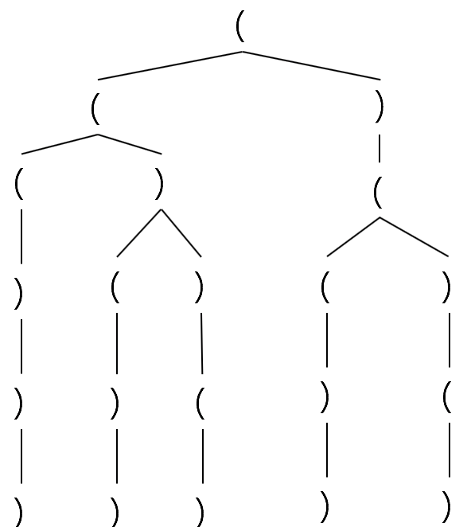

# 22. Generate Parentheses

链接: https://leetcode.com/problems/generate-parentheses/

题目：

Given *n* pairs of parentheses, write a function to generate all combinations of well-formed parentheses.

For example, given *n* = 3, a solution set is:

```
[
  "((()))",
  "(()())",
  "(())()",
  "()(())",
  "()()()"
]
```


# 解析

生成n对括号的所有情况，要求每种情况都要合法。

用的当然是递归树了 。一开始输入左括号，接着开始递归，每次判断当前左括号数是否大于右括号数，如果是就可递归左括号和右括号；否则只能左括号。 

当左括号有n个时只能递归右括号，当左右括号数都为n时加入List。

n=3的树如图 。

<div align="center"></div>

代码如下

```python
class Solution(object):
    def generateParenthesis(self, n):
        """
        :type n: int
        :rtype: List[str]
        """
        def generate(l, r, n, solution, solutions):
            if l==n and r==n:
                solutions.append(solution)
                return
            if l<n:
                generate(l+1, r, n, solution+'(', solutions)
            if r<l:
                generate(l ,r+1, n, solution+')', solutions)
        
        solutions = []
        generate(0, 0, n, "", solutions)
        return solutions
```

