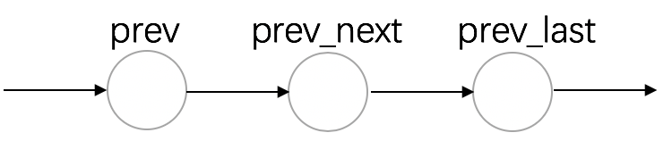
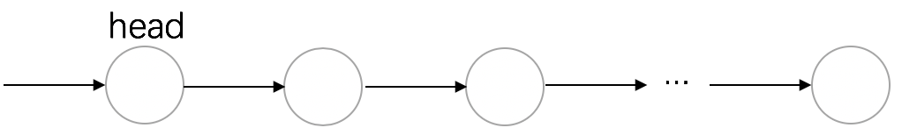
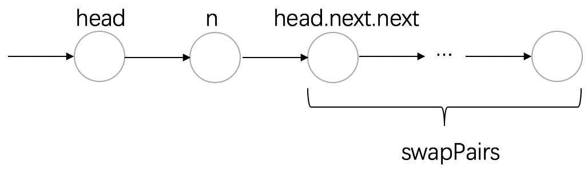
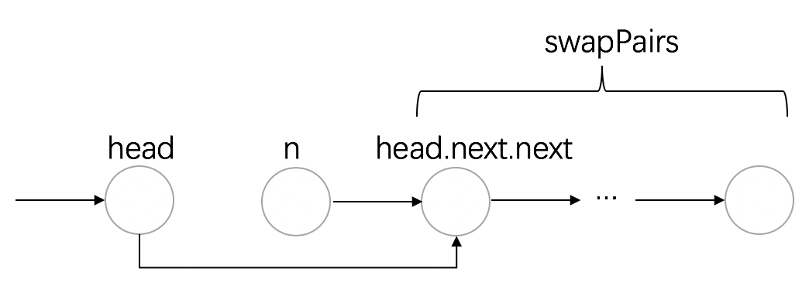
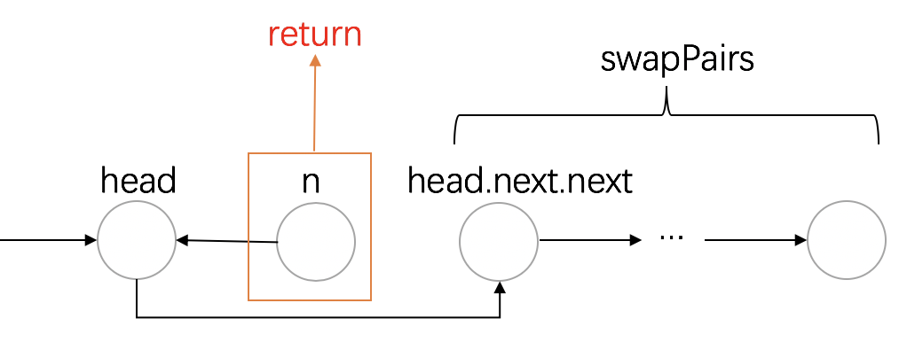

# 24. Swap Nodes in Pairs

链接: https://leetcode.com/problems/swap-nodes-in-pairs/

题目：

Given a linked list, swap every two adjacent nodes and return its head.

**Example:**

```
Given 1->2->3->4, you should return the list as 2->1->4->3.
```

**Note:**

- Your algorithm should use only constant extra space.
- You may **not** modify the values in the list's nodes, only nodes itself may be changed.

# 解析

给定一个链表，在常数空间复杂度内两两交换结点。有递归与非递归做法。

## 递归

根据题目要求，只能在原链表上操作了。我们可以先写出交换两个链表结点的操作，给出一个链表中的两个结点如下所示，待交换的结点为`prev_next`与`prev_last`

<div align="center"></div>	

交换两个相邻结点要分三步，代码如下所示。所以交换相邻结点需要三个指针，分别是待交换的两个指针，以及指向该相邻指针的指针。

```python
prev_next.next = prev_last.next
prev_last.next = prev_next
prev.next = prev_last
```

我们回到题目，要两两交换结点前，可通过`prev`获取`prev_next`以及`prev_last`。因此每次只需要一个指针`prev`即可，并通过`prev`的移动，指向下一对待交换的结点。

用上一个头指针指向`head`的小技巧，这样就可以少考虑很多情况。

```python
# Definition for singly-linked list.
# class ListNode(object):
#     def __init__(self, x):
#         self.val = x
#         self.next = None

class Solution(object):
    def swapPairs(self, head):
        """
        :type head: ListNode
        :rtype: ListNode
        """
        if not head or not head.next:
            return head
        
        Head = ListNode(0)
        Head.next, prev = head, Head
        
        while prev and prev.next and prev.next.next:
            prev_next, prev_last = prev.next, prev.next.next
            
            prev_next.next = prev_last.next
            prev_last.next = prev_next
            prev.next = prev_last
            
            prev = prev.next.next
            
        return Head.next
```


## 非递归

在之前的题目我们有提到，递归的精髓就在于只考虑函数返回的是什么，不用去细究每一次函数的调用都做了什么。

首先明确`swapPairs`函数的作用是将传进来的head链表进行两两调转，并返回链表。

每次递归我们都要做结点的交换，每次交换head与head.next，分成三步：

* 获取head.next，即指针n
* 对head.next.next进行结点互换后，head指向该互换后的链表
* n指向head

我们用图来形象生动的描绘一下

一开始如下

<div align="center"></div>	

获取指针n，对head.next.next进行`swapPairs`

<div align="center"></div>	

head指向head.next.next

<div align="center"></div>	

最后完成交换

<div align="center"></div>	

```python
# Definition for singly-linked list.
# class ListNode(object):
#     def __init__(self, x):
#         self.val = x
#         self.next = None

class Solution(object):
    def swapPairs(self, head):
        """
        :type head: ListNode
        :rtype: ListNode
        """
        if not head or not head.next:
            return head
        n = head.next
        head.next = self.swapPairs(head.next.next)
        n.next = head
        return n
```

