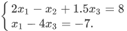
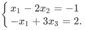
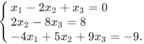
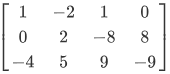
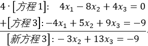
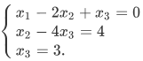
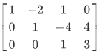
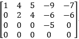
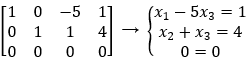
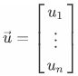

# 目录

<!-- TOC -->

- [线性方程组](#线性方程组)
  - [概念](#概念)
  - [矩阵](矩阵)
- [2](#生成模型与判别模型)

<!-- /TOC -->

# 线性方程组

## 概念

​	包含未知数的  一个**线性方程**是形如

的方程，其中  与系数  是实数或复数，通常是已知数。

​	而**线性方程组**是由一个或多个包含相同变量  的线性方程组成的。例如：

线性方程组的一组解是一组数 ，用这组数分别代替  时所有方程两边相等。

​	方程组所有可能的解的集合称为线性方程组的**解集**。若是两个线性方程组有相同的解集，则它们等价。

​	求包含两个未知数的两个方程组成的方程组的解，等价于求两条直线的交点，例如：

这两个方程的图形都是直线，两条直线可能交于一点、不相交(平行)、重合，分别对应于一个解、无解、无穷多解的情况。

## 矩阵

### 矩阵引入

​	一个线性方程组包含的主要信息可以用**矩阵**表示，给出方程组

把每一个变量的系数写在对齐的一列中，矩阵

称之为该方程组的**系数矩阵**，而

称之为**增广矩阵**。

### 线性方程组求解

​	基本的思路是把方程组用一个更容易解的等价方程组代替。

​	粗略地说，我们用第一个方程组中第一个方程中含  的项消去其他方程中的含  的项，然后用第二个方程中含  的项消去其他方程中的含  的项，以此类推，最后得到一个很简单的等价方程组(阶梯状的方程组)。

​	例如：

  

可以将第一个方程*4加上第3个方程，从而得到新的方程3.如下所示

就可以得到一个新的方程组和矩阵。以此类推最终得到阶梯状的方程组为

  

就这样，我们可以很容易地知道原方程组的解为`(29,16,3) `

​       下面我们引入行初等变换：

1. (倍加变换) 把某一行换成它本身与另一行的倍数的和。

2. (对数变换) 把两行对换。

3. (倍乘变换) 把某一行的所有元素乘以同一个非零数。

若其中一个矩阵经过若干行初等变换变换为另一个矩阵，我们称这两个矩阵为行等价的。

### 主元

​	对于一个阶梯型矩阵，我们定义**主元元素**与**主元列**。下面是几个概念：

- 先导元素：(非零行中)该行最左边的非零元素。
- 主元位置：阶梯型矩阵中先导元素的位置
- 主元列：含有先导元素的列

​       我们举个例子，如下所示

​	可以知道，主元列是第1、2、4列，主元为1、2、-5.

​	通过先前的知识可以知道，矩阵可以对应于一个线性方程组，例如：

对应于主元列的变量  和  称为**基本变量**，其他变量 () 称为**自由变量**。

## 向量方程

​	仅含一列的矩阵称为**列向量**，或简称**向量**。

​	若是  是正整数， 表示所有  个实数数列(或有序  元组)的集合，通常写成  列矩阵的形式，如

$$
\vec{u}=\begin{bmatrix}
u_{1}\\
\vdots\\
u_{n}
\end{bmatrix}

\begin{equation}
\begin{cases}
x_{1}-2x_{2}+x_{3}=0\\
x_{2}-4x_{3}=4\\
x_{3}=3.
\end{cases}
\end{equation}
$$

## 矩阵方程

