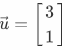
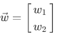
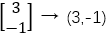
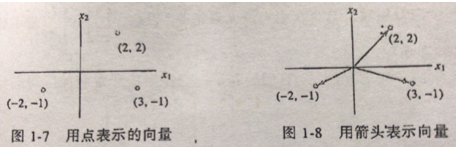
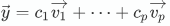
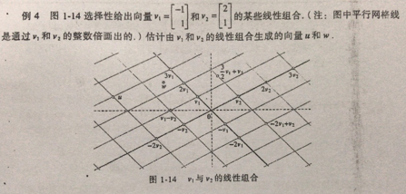
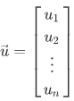

# 目录

<!-- TOC -->

- [线性方程组](#线性方程组)
  - [概念](#概念)
  - [矩阵](#矩阵)
    * [矩阵引入](#矩阵引入)
    * [线性方程组求解](#线性方程组求解)
    * [主元](#主元)
  - [向量方程](#向量方程)
  - [矩阵方程](#矩阵方程)
- 
- 

<!-- /TOC -->

# 线性方程组

## 概念

​	包含未知数的  一个**线性方程**是形如

的方程，其中  与系数  是实数或复数，通常是已知数。

​	而**线性方程组**是由一个或多个包含相同变量  的线性方程组成的。例如：

线性方程组的一组解是一组数 ，用这组数分别代替  时所有方程两边相等。

​	方程组所有可能的解的集合称为线性方程组的**解集**。若是两个线性方程组有相同的解集，则它们等价。

​	求包含两个未知数的两个方程组成的方程组的解，等价于求两条直线的交点，例如：

这两个方程的图形都是直线，两条直线可能交于一点、不相交(平行)、重合，分别对应于一个解、无解、无穷多解的情况。

## 矩阵

### 矩阵引入

​	一个线性方程组包含的主要信息可以用**矩阵**表示，给出方程组

把每一个变量的系数写在对齐的一列中，矩阵

称之为该方程组的**系数矩阵**，而

称之为**增广矩阵**。

### 线性方程组求解

​	基本的思路是把方程组用一个更容易解的等价方程组代替。

​	粗略地说，我们用第一个方程组中第一个方程中含  的项消去其他方程中的含  的项，然后用第二个方程中含  的项消去其他方程中的含  的项，以此类推，最后得到一个很简单的等价方程组(阶梯状的方程组)。

​	例如：

  

可以将第一个方程*4加上第3个方程，从而得到新的方程3.如下所示

就可以得到一个新的方程组和矩阵。以此类推最终得到阶梯状的方程组为

  

就这样，我们可以很容易地知道原方程组的解为`(29,16,3) `

​       下面我们引入行初等变换：

1. (倍加变换) 把某一行换成它本身与另一行的倍数的和。

2. (对数变换) 把两行对换。

3. (倍乘变换) 把某一行的所有元素乘以同一个非零数。

若其中一个矩阵经过若干行初等变换变换为另一个矩阵，我们称这两个矩阵为行等价的。

### 主元

​	对于一个阶梯型矩阵，我们定义**主元元素**与**主元列**。下面是几个概念：

- 先导元素：(非零行中)该行最左边的非零元素。
- 主元位置：阶梯型矩阵中先导元素的位置
- 主元列：含有先导元素的列

​       我们举个例子，如下所示

​	可以知道，主元列是第1、2、4列，主元为1、2、-5.

​	通过先前的知识可以知道，矩阵可以对应于一个线性方程组，例如：

对应于主元列的变量  和  称为**基本变量**，其他变量 () 称为**自由变量**。

## 向量方程

### 向量

​	仅含一列的矩阵称为**列向量**，或简称**向量**。

​	若是  是正整数， 表示所有  个实数数列(或有序  元组)的集合，通常写成  列矩阵的形式，如

​	所有元素都是零的向量称为零向量，用 表示。

​	下面举个例子：

​	这里和  和  是任意实数。所有的两个元素的向量的集记为  ，表示向量中的元素是实数，而指数2表示每个向量包含两个元素。

​     向量之间是可以做加减的，就是对应元素做加减得到新的向量；也支持和实数做标量乘法，就是实数与每个元素做乘法得到新的向量。

​       有时为了方便，我们会将列向量写成括号的形式，例如

可以理解为是一个集合点对， 看作是平面上所有点的集合，而向量的几何表示是一条由原点`(0,0)`指向点`(3,-1)`的有向线段，如图。

​	其他维度的也同理。

### 线性组合

​	给定  中向量  和标量  ，向量

称为向量 以 为权的**线性组合**。 

​	线性组合可以在几何上去理解，线性组合后的向量与其他向量一样，均是空间中的一个点。它的形成方式如下所示

​	也就是例如

可以当成是从原点开始沿着  的方向走了三个单位，再沿着  方向走了-2个单位。

​	线性代数的一个主要思想是研究可以表示为某一固定向量集合  的线性组合的所有向量。若  是  中的向量。则  的所有线性组合所称的集合用记号表示称为

​	所有元素都是零的向量称为零向量，用  表示。

​	下面举个例子：

这里和是任意实数。所有的两个元素的向量的集记为，表示向量中的元素是实数，而指数2表示每个向量包含两个元素。

$$
\vec{u}=\begin{bmatrix}
u_{1}\\
u_{2}\\
\vdots\\
u_{n}
\end{bmatrix}

\begin{equation}
\begin{cases}
x_{1}-2x_{2}+x_{3}=0\\
x_{2}-4x_{3}=4\\
x_{3}=3.
\end{cases}
\end{equation}

\vec{u}=3\vec{v_{1}}-2\vec{v_{2}}
$$

## 矩阵方程

